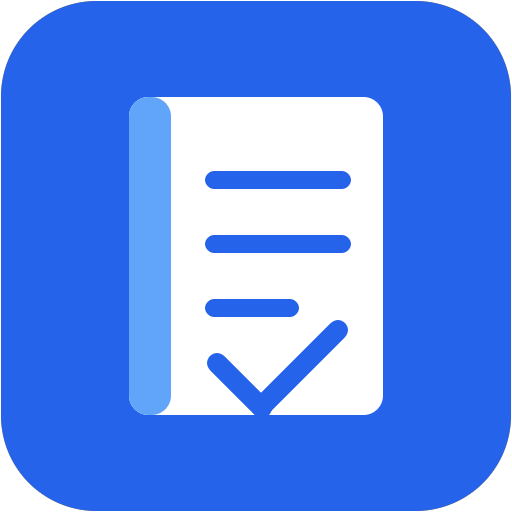
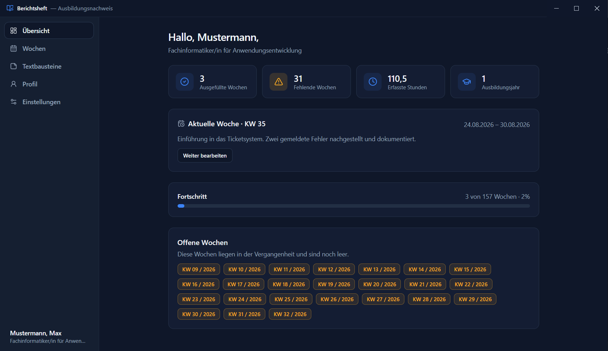
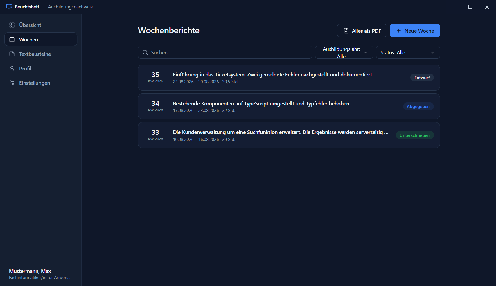
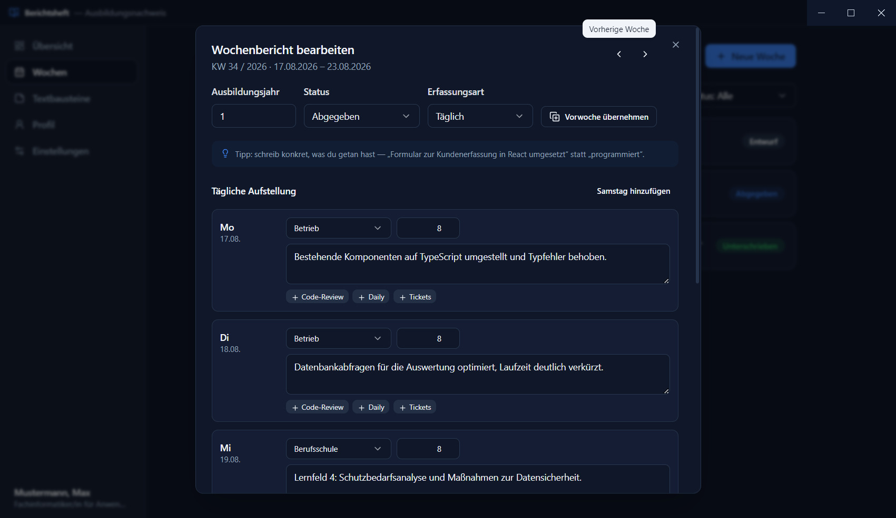
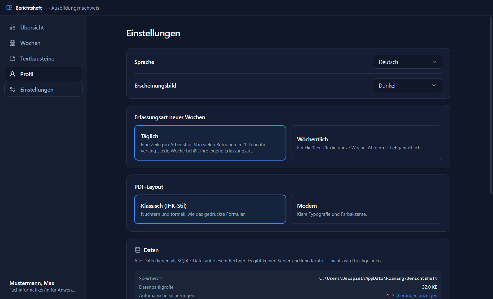
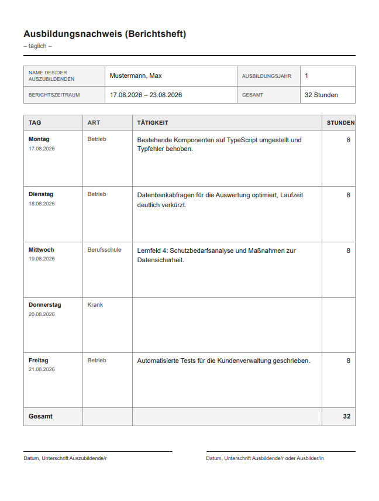
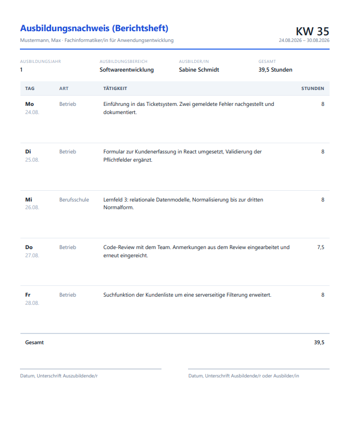

<div align="center">



# Berichtsheft

**Der Ausbildungsnachweis als Desktop-App — offline, ohne Konto, mit PDF-Export.**

[](https://github.com/KamilAhmedov/Berichtsheft/actions/workflows/ci.yml)
[](LICENSE)


[Deutsch](README.md) · [English](README.en.md) · [Türkçe](README.tr.md)

</div>

---

> **Hinweis:** Diese Anwendung wurde mit Unterstützung von KI entwickelt —
> Konzept, Code und Dokumentation entstanden gemeinsam mit Claude (Anthropic).

## Worum geht es?

Jede und jeder Auszubildende in Deutschland muss einen **Ausbildungsnachweis** führen — das
Berichtsheft. Wöchentlich wird festgehalten, was im Betrieb gemacht und in der Berufsschule
gelernt wurde. Der Ausbilder unterschreibt, und ohne vollständiges Berichtsheft gibt es keine
Zulassung zur IHK-Prüfung.

In der Praxis läuft das über eine Word-Vorlage oder ein Papierheft. Wochen bleiben liegen,
das Layout verrutscht, und am Ende füllt man drei Monate an einem Abend nach.

Diese App macht daraus etwas Geradliniges: Woche auswählen, eintragen, fertig. Die App
rechnet Kalenderwochen und Lehrjahre selbst aus, zeigt offene Wochen an und erzeugt auf
Knopfdruck ein PDF im IHK-Stil.

## Bildschirmfotos

<table>
  <tr>
    <td width="50%"></td>
    <td width="50%"></td>
  </tr>
  <tr>
    <td align="center"><sub>Übersicht — Fortschritt, aktuelle Woche und offene Wochen</sub></td>
    <td align="center"><sub>Wochen — alle Berichte mit Suche, Filtern und Status</sub></td>
  </tr>
  <tr>
    <td width="50%"></td>
    <td width="50%"></td>
  </tr>
  <tr>
    <td align="center"><sub>Wochenbericht — tägliche Erfassung mit Textbausteinen</sub></td>
    <td align="center"><sub>Einstellungen — dunkles Design, Sprache, Datenablage</sub></td>
  </tr>
  <tr>
    <td width="50%"></td>
    <td width="50%"></td>
  </tr>
  <tr>
    <td align="center"><sub>PDF — klassisches Layout, an den IHK-Vordruck angelehnt</sub></td>
    <td align="center"><sub>PDF — modernes Layout, klare Typografie</sub></td>
  </tr>
</table>

## Funktionen

- **Zwei Erfassungsarten**: täglich (eine Zeile je Arbeitstag, mit Urlaub/Krank/Feiertag) oder wöchentlich als Fließtext
- **Wochenberichte** mit betrieblichen Tätigkeiten, Berufsschule und Unterweisungen — je mit Stundenangabe
- **Kalenderwochen nach ISO 8601** — Zeitraum und Lehrjahr werden automatisch berechnet
- **Lückenanzeige** — vergangene Wochen ohne Eintrag sind auf der Übersicht sofort sichtbar
- **PDF-Export** in zwei Layouts: *Klassisch* (nüchtern, wie das gedruckte Formular) und *Modern*
- **Textbausteine** für wiederkehrende Tätigkeiten — einmal schreiben, per Klick einfügen
- **Status je Woche**: Entwurf → Abgegeben → Unterschrieben
- **Drei Sprachen**: Deutsch, English, Türkçe
- **Helles und dunkles Design**, folgt auf Wunsch der Windows-Einstellung
- **Export und Import** als eine JSON-Datei — Umzug auf einen anderen Rechner in zwei Schritten
- **Automatische Sicherungen** — die letzten zehn Stände, in der App auflistbar und mit einem Klick zurückspielbar
- **Statistik** — Stunden je Monat, Verteilung der Tage, Wochen nach Status
- **Rechtschreibprüfung** in der Sprache der Oberfläche, Vorschläge per Rechtsklick

## Datenschutz

Die App hat **keinen Server, kein Konto und keine Internetverbindung**. Alles liegt in einer
SQLite-Datei auf dem eigenen Rechner:

```
%APPDATA%\Berichtsheft\
├── data\berichtsheft.db     ← alle Berichte
└── backups\                 ← die letzten zehn automatischen Sicherungen
```

Den Ordner öffnet man in der App direkt über **Einstellungen → Daten → Ordner öffnen**.
Eine Deinstallation löscht diesen Ordner nicht.

## Installation

### Fertige Version herunterladen (empfohlen)

Unter [**Releases**](https://github.com/KamilAhmedov/Berichtsheft/releases) liegen zwei Dateien:

| Datei | Wofür |
| --- | --- |
| `Berichtsheft-Setup-1.1.0.exe` | Normale Installation mit Startmenü-Eintrag und Desktop-Verknüpfung |
| `Berichtsheft-1.1.0-portable.exe` | Ohne Installation — Doppelklick genügt, läuft auch vom USB-Stick |

> **Hinweis zu Windows SmartScreen**
> Die Installer sind nicht mit einem kostenpflichtigen Zertifikat signiert. Windows zeigt
> deshalb beim ersten Start „Der Computer wurde durch Windows geschützt“. Auf
> **Weitere Informationen** klicken und dann auf **Trotzdem ausführen**. Der Quellcode
> dieses Projekts ist vollständig einsehbar, und die Installer werden von GitHub Actions
> aus genau diesem Quellcode gebaut.

### Selbst aus dem Quellcode bauen

Auch ohne Programmierkenntnisse machbar — die Schritte sind vollständig aufgeführt.

**1. Node.js installieren**

Node.js ist die Laufzeitumgebung, mit der die App gebaut wird.
Auf [nodejs.org](https://nodejs.org) die **LTS**-Version herunterladen und installieren
(alle Vorgaben im Installer können unverändert bleiben). Danach den Rechner einmal neu
starten oder zumindest alle Terminal-Fenster schließen.

Zum Prüfen ein neues Terminal öffnen und eingeben:

```bash
node -v
```

Erscheint eine Versionsnummer wie `v20.10.0`, hat alles geklappt.

**2. Den Quellcode holen**

Entweder mit Git:

```bash
git clone https://github.com/KamilAhmedov/Berichtsheft.git
cd berichtsheft
```

Oder ohne Git: oben auf dieser Seite auf den grünen Knopf **Code** → **Download ZIP**,
die Datei entpacken und den entstandenen Ordner öffnen.

**3. Ein Terminal in diesem Ordner öffnen**

Im Explorer in den Projektordner wechseln, dann **Umschalt + Rechtsklick** auf eine leere
Stelle im Ordner und **PowerShell-Fenster hier öffnen** wählen. Alternativ in die
Adressleiste des Explorers `powershell` eintippen und Enter drücken.

**4. Abhängigkeiten installieren**

```bash
npm install
```

Das lädt die benötigten Pakete herunter und dauert beim ersten Mal ein paar Minuten.
Warnungen mit `npm warn deprecated` sind normal und können ignoriert werden.

**5. App starten**

```bash
npm run dev
```

Das Fenster öffnet sich von selbst. Änderungen am Quellcode werden sofort übernommen.

**6. Installer bauen (optional)**

```bash
npm run dist
```

Die fertigen `.exe`-Dateien liegen anschließend im Ordner `release/`.

### Wenn etwas nicht klappt

| Meldung | Ursache und Lösung |
| --- | --- |
| `npm` wird nicht als Befehl erkannt | Node.js ist nicht installiert oder das Terminal war beim Installieren schon offen. Alle Terminal-Fenster schließen und ein neues öffnen. |
| `Die Ausführung von Skripts ist auf diesem System deaktiviert` | PowerShell blockiert Skripte. Einmalig ausführen: `Set-ExecutionPolicy -Scope CurrentUser RemoteSigned` |
| Die Installation bricht bei `better-sqlite3` ab | Es fehlen fertige Binärdateien für diese Node-Version. Mit der LTS-Version von Node.js arbeiten (siehe Schritt 1). |
| Das Fenster bleibt weiß | `npm run build` ausführen und danach `npm start`. |

## Technik

| Bereich | Verwendet |
| --- | --- |
| Laufzeit | Electron 33 |
| Oberfläche | React 18, TypeScript, Tailwind CSS, Radix UI, Recharts |
| Daten | SQLite über better-sqlite3, WAL-Modus |
| Build | electron-vite, electron-builder |
| PDF | Chromium `printToPDF` — volle Unicode-Unterstützung ohne eingebettete Schriften |

### Aufbau

```
berichtsheft/
├── electron/           Hauptprozess: Fenster, Datenbank, Dateidialoge, PDF
│   ├── main.ts         Lebenszyklus und IPC-Endpunkte
│   ├── db.ts           SQLite-Zugriff, Migrationen, Sicherungen
│   ├── pdf.ts          HTML-Vorlagen und PDF-Erzeugung
│   └── preload.ts      Die einzige Brücke zum Renderer
├── shared/             Von beiden Seiten genutzt
│   ├── types.ts        Datenmodell
│   ├── dates.ts        ISO-8601-Kalenderwochen, ohne Fremdbibliothek
│   └── pdfLabels.ts    Beschriftungen im PDF
├── src/                Oberfläche (Renderer)
│   ├── components/     Ansichten und UI-Bausteine
│   ├── hooks/useApp    Zustand, Übersetzungen, Meldungen
│   ├── i18n/           Wörterbücher für de, en, tr
│   └── lib/            Wochenlogik und Hilfsfunktionen
└── scripts/            Erzeugt das App-Symbol ohne Bildbearbeitung
```

Der Renderer hat weder Node.js noch Dateizugriff. Alles läuft über die schmale
Schnittstelle in `preload.ts` — dadurch bleibt die Angriffsfläche klein und der
Datenzugriff an einer Stelle nachvollziehbar.

`electron/db.ts` ist bewusst hinter einer engen Funktionsmenge gekapselt. Ein späterer
Cloud-Abgleich müsste nur diese Funktionen ersetzen, ohne die Oberfläche anzufassen.

## Geplant

- Auswahl mehrerer Wochen für einen gemeinsamen Export
- Monatsansicht als dritte Erfassungsart
- Textbausteine je Lehrjahr statt global
- Pakete für macOS und Linux

## Mitmachen

Fehlermeldungen und Vorschläge sind willkommen — siehe [CONTRIBUTING.md](CONTRIBUTING.md).

## Lizenz

[MIT](LICENSE) — frei verwendbar, auch für eigene Anpassungen.
